## Credits
All images these are property of Clapfoot Inc.
# Items

| Image | Path |
| - | - |
|  | antitankmineitem.png |
|  | assaultrifleammoitem.png |
|  | assaultrifleheavycitem.png |
|  | assaultrifleheavywitem.png |
|  | assaultrifleitem.png |
|  | atammo.png |
|  | atgrenadew.png |
|  | atmortarammoitem.png |
|  | atmortaritem.png |
|  | atmortarwtripoditem.png |
|  | atrifleammoitem.png |
|  | atrifleitem.png |
|  | atrpgammoitem.png |
|  | atrpgcitem.png |
|  | atrpgitem.png |
|  | atrpglightcitem.png |
|  | bandagesitem.png |
|  | basicmaterials.png |
|  | battletankammoitem.png |
|  | bayonet.png |
|  | binocularsitem.png |
|  | bloodplasmaitem.png |
|  | bunkersupplies.png |
|  | carbineitem.png |
|  | civicmaterials.png |
|  | clipboard.png |
|  | clothitem.png |
|  | components.png |
|  | crateitem.png |
|  | criticallywounded.png |
|  | crudeoil.png |
|  | deadlygas01.png |
|  | deployabletripoditem.png |
|  | explosivematerial.png |
|  | fieldmgammoitem.png |
|  | firstaidkititem.png |
|  | fistitem.png |
|  | garrisonsupplies.png |
|  | gasmask.png |
|  | gasmaskfilter.png |
|  | grenadeadapter.png |
|  | grenadecitem.png |
|  | grenadeitem.png |
|  | hammer.png |
|  | heavyartilleryammoitem.png |
|  | heavyexplosivematerial.png |
|  | heavymachinegun.png |
|  | hegrenadeitem.png |
|  | infantrysupportgunitem.png |
|  | ladder.png |
|  | lightartilleryammo.png |
|  | lightartilleryammoitem.png |
|  | lightmachinegun.png |
|  | lighttankammoitem.png |
|  | lore.png |
|  | lore2.png |
|  | lore3.png |
|  | lorebird.png |
|  | loreboardgame.png |
|  | lorebucket.png |
|  | lorecave.png |
|  | lorecorpse.png |
|  | lorefire.png |
|  | loregraves.png |
|  | lorerock.png |
|  | loresabre.png |
|  | loreshovel.png |
|  | loreskull.png |
|  | lorestatue.png |
|  | loresunflower.png |
|  | loretree.png |
|  | lrartilleryammoitem.png |
|  | machinegunammo.png |
|  | mgcitem.png |
|  | mgwitem.png |
|  | minitankammoitem.png |
|  | monument.png |
|  | mortarammo.png |
|  | mortaritem.png |
|  | mortartank.png |
|  | pistolammoitem.png |
|  | pistolitem.png |
|  | pistollightwitem.png |
|  | prototypekit.png |
|  | radiobackpackitem.png |
|  | radioitem.png |
|  | readablesign.png |
|  | refinedfuel.png |
|  | refinedmaterials.png |
|  | relicmaterialitem.png |
|  | relicrifle.png |
|  | resoucealuminum.png |
|  | resoucealuminumrefined.png |
|  | resouceiron.png |
|  | resouceironrefined.png |
|  | resourcecopper.png |
|  | revolverammoitem.png |
|  | revolveritem.png |
|  | rifleammoitem.png |
|  | riflecitem.png |
|  | rifleitem.png |
|  | riflelightcitem.png |
|  | rocketbooster.png |
|  | rocketwarhead.png |
|  | rpgammoitem.png |
|  | rpgitem.png |
|  | salvage.png |
|  | servertravel.png |
|  | shotgunammoitem.png |
|  | shotgunitem.png |
|  | shovel.png |
|  | sledgehammeritem.png |
|  | smgcitem.png |
|  | smgheavycitem.png |
|  | smgheavywitem.png |
|  | smokegrenadeicon1.png |
|  | sniperrifleammoitem.png |
|  | sniperriflecitem.png |
|  | sniperrifleitem.png |
| 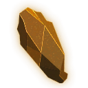 | soulstone01.png |
| 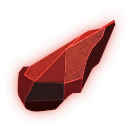 | soulstone02.png |
| 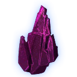 | soulstone03.png |
|  | stickybomb.png |
|  | submachinegun.png |
|  | submachinegunammo.png |
|  | subtypeantitank.png |
|  | subtypeap.png |
|  | subtypeat.png |
|  | subtypefl.png |
|  | subtypega.png |
|  | subtypehb.png |
|  | subtypehe.png |
|  | subtypelra.png |
|  | subtypesb.png |
|  | subtypese.png |
|  | subtypesh.png |
|  | subtypesmk.png |
|  | sulfur.png |
|  | tobaccopickup.png |
|  | traumakititem.png |
|  | undeadattack1.png |
|  | undeadattack2.png |
|  | undeadattack3.png |
|  | unexplodedordnance.png |
|  | wall-t1.png |
|  | wall-t2.png |
|  | wall-t3.png |
|  | workwrench.png |
|  | wounded.png |

# Map

| Image | Path |
| - | - |
| 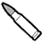 | armory.png |
|  | borderbase.png |
|  | bunkerbasetier1.png |
|  | bunkerbasetier2.png |
|  | bunkerbasetier3.png |
|  | c-diamond-act.png |
|  | c-diamond-deact.png |
|  | c-dot-act.png |
|  | c-dot-deact.png |
|  | c-shevron-act.png |
|  | c-shevron-deact.png |
|  | c-shield-act.png |
|  | c-shield-deact.png |
|  | c-square-act.png |
|  | c-square-deact.png |
|  | c-triang-act.png |
|  | c-triang-deact.png |
|  | civiccenter.png |
|  | coastalgun.png |
|  | componentmine.png |
|  | components.png |
|  | conquestc.png |
|  | conquestw.png |
|  | constructionyard.png |
|  | event.png |
|  | eventc.png |
|  | eventw.png |
|  | factory.png |
|  | focus_corner.png |
|  | fort.png |
|  | fortcursed.png |
|  | forwardbase1.png |
|  | forwardbase2.png |
|  | frontierbase.png |
|  | fuel.png |
|  | hometownhallneutral.png |
|  | hospital.png |
|  | indicator_allowed.png |
|  | indicator_combat.png |
|  | indicator_lock.png |
|  | indicator_queue.png |
|  | legendchevron.png |
|  | legenddiamond.png |
|  | legenddot.png |
|  | legendshield.png |
|  | legendsquare.png |
|  | legendtriangle.png |
|  | legendwin.png |
|  | manufacturing.png |
|  | maplocation_diamond.png |
|  | maplocation_diamondhover.png |
|  | massproductionfactory.png |
|  | observationtower.png |
|  | operation_symbol_24px.png |
|  | operation_symbol_36px.png |
|  | outpost.png |
|  | relicbase.png |
|  | rocketfacility.png |
|  | safehouse.png |
| 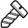 | salvage.png |
|  | scorchedtown.png |
|  | scrapmine.png |
|  | seaport.png |
|  | shipyard.png |
|  | skeep.png |
|  | skirmishc.png |
|  | skirmishw.png |
| 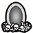 | soulfactory.png |
|  | staticbase1.png |
|  | staticbase2.png |
|  | staticbase3.png |
|  | storagefacility.png |
|  | strainingground.png |
| 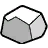 | sulfur.png |
| 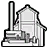 | sulfurmine.png |
|  | supplies.png |
|  | techcenter.png |
|  | townhallneutral.png |
|  | troopship.png |
|  | uprising.png |
|  | vehicle.png |
|  | victory.png |
|  | w-diamond-act.png |
|  | w-diamond-deact.png |
|  | w-dot-act.png |
|  | w-dot-deact.png |
|  | w-shevron-act.png |
|  | w-shevron-deact.png |
|  | w-shield-act.png |
|  | w-shield-deact.png |
|  | w-square-act.png |
|  | w-square-deact.png |
|  | w-triang-act.png |
|  | w-triang-deact.png |
|  | watchtoweroverlay.png |
|  | weathereventrain.png |
|  | weathereventsnow.png |
|  | workshop.png |
|  | worldbg.png |

# Menus

| Image | Path |
| - | - |
|  | bangaloreitem.png |
|  | bg.png |
|  | bg192x44.png |
|  | bg192x45.png |
|  | bg200x50px_a.png |
|  | bg200x50px_b.png |
|  | bg261x284.png |
|  | bgbox233x300.png |
|  | bgbox233x300_wheader.png |
|  | bgequipped.png |
|  | bggenericbox.png |
|  | bghoverbox.png |
|  | bghoverbox_nobottom.png |
|  | bgitembox.png |
|  | bgitemboxwhite.png |
|  | bgitemcount.png |
|  | bgmarkernotif.png |
|  | bgnotification.png |
| 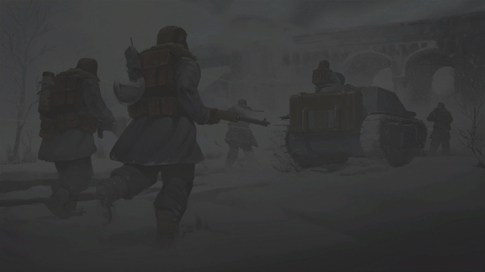 | bgopeningscreen.png |
|  | bgprimaryslot.png |
|  | bgsecondaryslot.png |
|  | bgserverlist.png |
|  | bgserverselection_info.png |
|  | bgtertiaryslot.png |
|  | btadd.png |
|  | btadddiesel.png |
|  | btaddpetrol.png |
|  | btalert.png |
|  | btalertminimize.png |
|  | btbuildrocket.png |
|  | btcancel.png |
|  | btchangefuel.png |
|  | btchatchecked.png |
|  | btchatunchecked.png |
|  | btcheckbox_empty.png |
|  | btcheckbox_no.png |
|  | btcheckbox_yes.png |
|  | btclaim.png |
|  | btcoalition.png |
|  | btcommendnormal.png |
|  | btcopyaccesscode.png |
|  | btdisband.png |
|  | btdiscord.png |
|  | btdiscordnormal.png |
|  | btdownvote.png |
|  | btdrivewayequipment.png |
|  | btedit.png |
|  | btgamemodeselection_disabled.png |
|  | btgear.png |
|  | bthidereservestockpile.png |
|  | btkick.png |
|  | btleave.png |
|  | btleftarrow.png |
|  | btlock.png |
|  | btlog.png |
|  | btnoaction.png |
|  | btpackage.png |
|  | btpickup.png |
|  | btpinpoint.png |
|  | btprototype.png |
|  | btquestionmark.png |
| 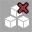 | btreleasereservestockpile.png |
|  | btrepair.png |
|  | btreprimandnormal.png |
|  | btrightarrow.png |
|  | btsetspawn.png |
|  | btshowreservestockpile.png |
|  | btstopfueling.png |
|  | btsubmit.png |
|  | btsubmitcode.png |
|  | btsubmitcrate.png |
|  | btsubmitlargeitem.png |
|  | btsubmitpatient.png |
|  | btsubmitstarter.png |
|  | btsubmitvehicle.png |
|  | bttabkey.png |
|  | bttechtree.png |
|  | btunclaim.png |
|  | btunlock.png |
|  | btunpackage.png |
|  | btupgrade.png |
|  | btupvote.png |
|  | btupvotenopadding.png |
|  | btviewaccesscode.png |
|  | btviolationlog.png |
|  | btvoicechecked.png |
|  | btvoiceunchecked.png |
|  | btwhisper.png |
|  | bunkersupply.png |
|  | chatmaximize.png |
|  | chatminimize.png |
|  | conditiontime.png |
|  | demote.png |
|  | dropdownarrow.png |
|  | dropdownbg.png |
|  | dropdownborder.png |
|  | dropdownselect.png |
|  | edit.png |
|  | emptytransparent.png |
|  | enter.png |
|  | facilitiesadvancedmining.png |
|  | facilitiesartilleryshelter.png |
|  | facilitiesdeploymentpoint.png |
|  | facilitiesfortifications.png |
|  | facilitiesindustry.png |
|  | facilitieslargegarrison.png |
|  | facilitiesmortaremplacement.png |
|  | facilitiesprovisionalgarrison.png |
|  | facilitiesradiostation.png |
|  | facilitiesrepair.png |
|  | facilitiessmallgarrison.png |
|  | facilitiessupplies.png |
| 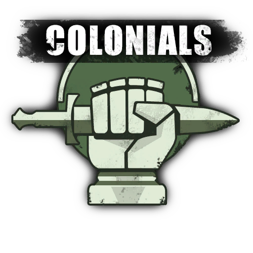 | factionbuttoncolonial.png |
|  | factionbuttonrandom.png |
| 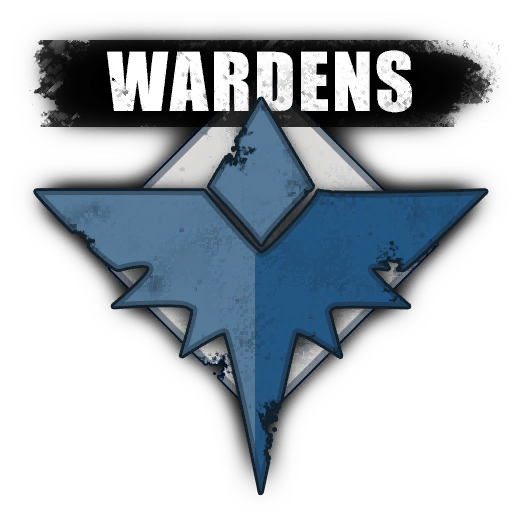 | factionbuttonwarden.png |
| 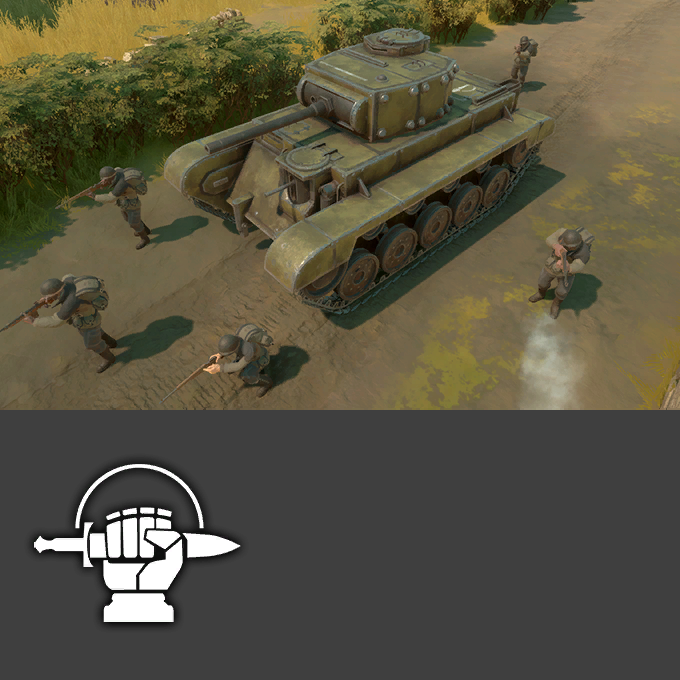 | factionselectcolonial.png |
| 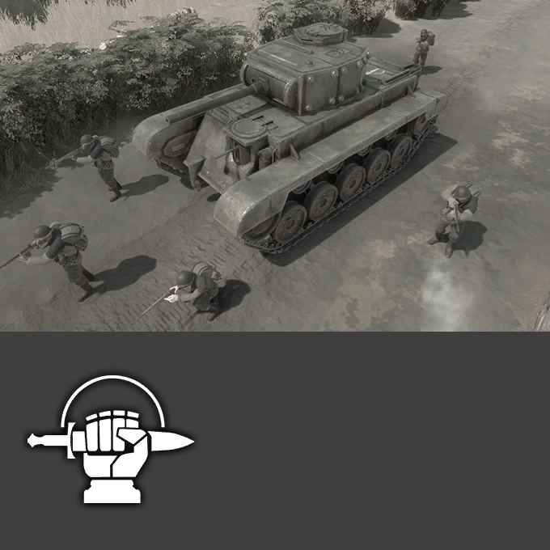 | factionselectcolonialdesaturated.png |
| 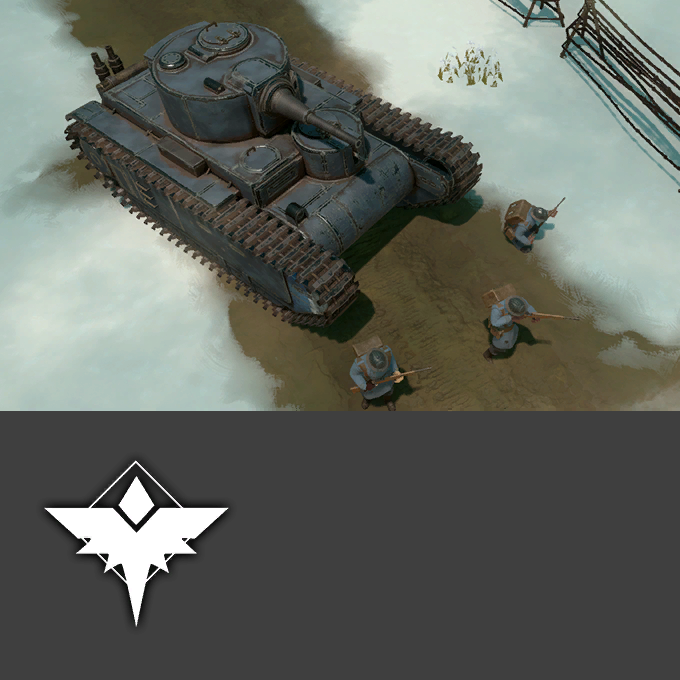 | factionselectwarden.png |
| 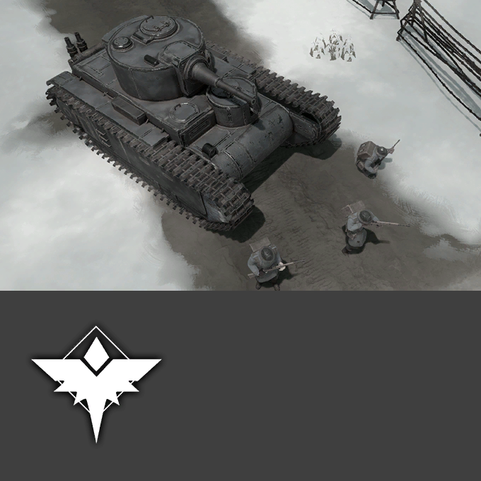 | factionselectwardendesaturated.png |
|  | filterall.png |
|  | filterbase.png |
|  | filtercrates.png |
|  | filtergarrisonstation.png |
|  | filterheavyweapons.png |
|  | filtermedical.png |
|  | filterpersonal.png |
|  | filtershippables.png |
|  | filtersmallweapons.png |
|  | filtersquad.png |
|  | filtertown.png |
|  | filterutility.png |
|  | filtervehicle.png |
|  | filterweaponsstructures.png |
|  | gamemodeselection_warningbg.png |
|  | garrisonsupply.png |
|  | header.png |
|  | hoverdetailsbg.png |
|  | infrastructurecommand.png |
|  | infrastructuregarrison.png |
|  | invite.png |
| 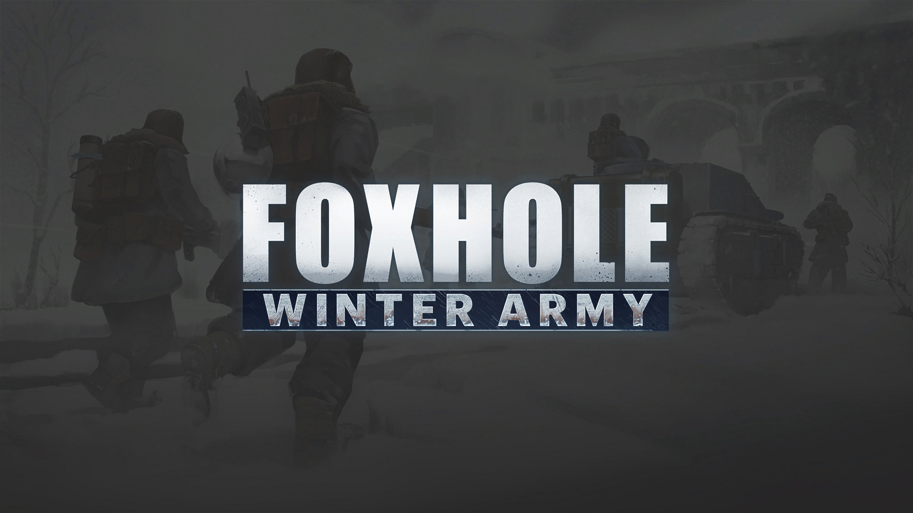 | loadingscreen.png |
|  | logocolonial64.png |
|  | logocolonialmono.png |
|  | logowarden64.png |
|  | logowardenmono.png |
|  | monumentlistborder.png |
|  | newsbg.png |
|  | newscardbg.png |
|  | patient.png |
|  | patientfill.png |
|  | post.png |
|  | productionarrowrightbg.png |
|  | productionarrowrightfill.png |
|  | promote.png |
|  | queueprogressbarbg.png |
|  | queueprogressbarfill.png |
|  | regionallaunchmarker.png |
|  | regioncontextbg.png |
|  | reply.png |
|  | sliderbarbg.png |
|  | sliderbarpointer.png |
|  | staminabarbg.png |
|  | staminabarfill.png |
|  | statuscover1.png |
|  | statuscover2.png |
|  | statuscover3.png |
|  | statuscriticalfreezingstate.png |
|  | statusfreezingstate.png |
|  | statusgasmask.png |
|  | statusmuddy.png |
|  | statusslowwarmingstate.png |
|  | statussuppression.png |
|  | statuswarmingstate.png |
|  | storage.png |
|  | surrenderflag_checked.png |
|  | surrenderflag_unchecked.png |
|  | titlebg_446px.png |
|  | tooltipsupporters.png |
|  | tooltiptime.png |
|  | votespecifiedcheck.png |
|  | warservicestatus.png |
| 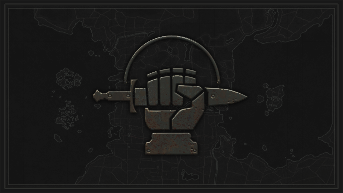 | worldcolonial.png |
| 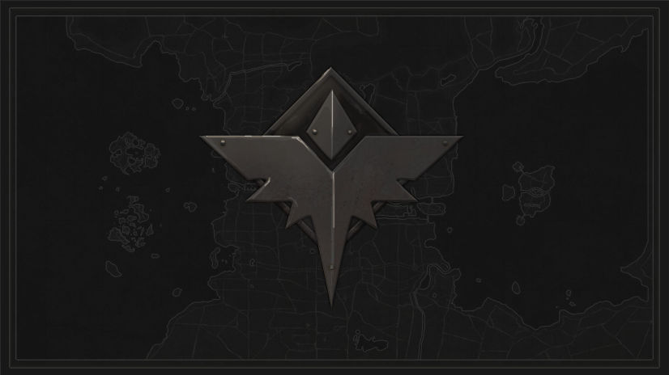 | worldwarden.png |

# Structuresenu

| Image | Path |
| - | - |
|  | ammoroom.png |
|  | barbedwirestructure.png |
|  | barracksstructure.png |
|  | buildablesignpost.png |
|  | campsitestructure.png |
|  | componentmine.png |
|  | concretemixer.png |
|  | emplacedat.png |
|  | emplacedhowitzer.png |
|  | emplacedmg.png |
|  | encampment.png |
|  | engineroom.png |
|  | engineroompipe.png |
|  | fieldhospital.png |
|  | firepit.png |
|  | fortimodbunkbed.png |
|  | fortimodchalkboard.png |
|  | fortimoddesk.png |
|  | fortimoddishwashstation.png |
|  | fortimodkitchen.png |
|  | fortimodlatrine.png |
|  | fortimodlocker.png |
|  | fortimodmodule.png |
|  | fortimodpantry.png |
|  | fortimodradiostation.png |
|  | fortimodstrategic.png |
|  | fortt1.png |
|  | fortt1base.png |
|  | fortt1corner.png |
|  | fortt1gunai.png |
|  | fortt1mgunai.png |
|  | fortt1ramp.png |
|  | fortt2.png |
|  | fortt2atgunai.png |
|  | fortt2base.png |
|  | fortt2corner.png |
|  | fortt2door.png |
|  | fortt2gunai.png |
|  | fortt2mgunai.png |
|  | fortt2ramp.png |
|  | fortt2window.png |
|  | fortt3.png |
|  | fortt3atgunai.png |
|  | fortt3base.png |
|  | fortt3corner.png |
|  | fortt3gunai.png |
|  | fortt3howitzerai.png |
|  | fortt3mgunai.png |
|  | fortt3ramp.png |
|  | forwardbase2.png |
|  | foxholestructure.png |
|  | foxholeturret.png |
|  | garrisonstructure.png |
|  | gate-t1.png |
|  | gate-t2.png |
|  | gate-t3.png |
|  | gunturretstructure.png |
|  | heavyartilleryc.png |
|  | heavyartilleryw.png |
|  | hospital.png |
|  | longrangedartillery.png |
|  | oilwellmine.png |
|  | outpoststructure.png |
|  | productionpartsstructure.png |
|  | resourcecontainer.png |
|  | sandbaghalfcornerstructure.png |
|  | sandbagsstructure.png |
|  | satchelcharge.png |
|  | scrapmine.png |
|  | shippingcontainerstructure.png |
|  | staticartillerystructure.png |
|  | storageitem.png |
|  | sulfurminestructure.png |
|  | tankstop.png |
|  | trenchbridge.png |
|  | trencht1.png |
|  | trencht1connector.png |
|  | trencht1emplacement.png |
|  | trencht2.png |
|  | trencht2connector.png |
|  | trencht2emplacement.png |
|  | trencht2ramp.png |
|  | trencht3.png |
|  | trencht3connector.png |
|  | trencht3emplacement.png |
|  | uniquewwarehouseg4.png |
|  | watchtowerstructure.png |

# Techtree

| Image | Path |
| - | - |
|  | reasearchlevel1.png |
|  | reasearchlevel2.png |
|  | researchunknown.png |
|  | techtreeresearchlocked.png |
|  | techtreeresearchstatus.png |
|  | techtreeresearchunlocked.png |

# Vehicles

| Image | Path |
| - | - |
|  | advancedconstruction.png |
|  | ambulance.png |
|  | ambulancewar.png |
|  | armoredcardefensivevehicle.png |
|  | armoredcarmobilitywarvehicle.png |
|  | armoredcaroffensivecvehicle.png |
|  | armoredcaroffensivewvehicle.png |
|  | armoredcarvehicle.png |
|  | armoredcarwarvehicle.png |
|  | artillery.png |
|  | bargevehicle.png |
|  | battletank.png |
|  | battletankdefensivevehicle.png |
|  | battletankwar.png |
|  | battletankwardefensivevehicle.png |
|  | battletankwarrangevehicle.png |
|  | bus.png |
|  | buswar.png |
|  | colonialmediumtank.png |
|  | colonialmediumtankoffensive.png |
|  | colonialrelicmediumtankvehicle.png |
|  | constructionvehicle.png |
|  | cranevehicle.png |
|  | destroyertankwvehicle.png |
|  | fieldantitankcolvehicle.png |
|  | fieldantitankwarvehicle.png |
|  | fieldartillerycolvehicle.png |
|  | fieldcannonwvehicle.png |
|  | fieldmachinegun.png |
|  | fieldmachinegunwar.png |
|  | fieldmortarw.png |
|  | flatbedtruckvehicle.png |
|  | freightervehicle.png |
|  | gunboatvehicle.png |
|  | gunboatwardoubleartilleryvehicle.png |
|  | gunboatwarvehicle.png |
|  | halftrackartilleryc.png |
|  | halftrackcolheavyarmorvehicle.png |
|  | halftrackcolvehicle.png |
|  | halftrackoffensivewarvehicle.png |
|  | halftrackvehicle.png |
|  | halftrackwarvehicle.png |
|  | harvester.png |
|  | landingcraftoffensivevehicle.png |
|  | landingcraftvehicle.png |
|  | landingcraftwarvehicle.png |
|  | lighttankartillerywar.png |
|  | lighttankcolmobilityvehicle.png |
|  | lighttankcolvehicle.png |
|  | lighttankoffensivecvehicle.png |
|  | lighttankwardefensivevehicle.png |
|  | lighttankwarvehicle.png |
|  | mortartankvehicle.png |
|  | mortartankwarvehicle.png |
|  | motorboat.png |
|  | motorcycleoffensivevehicle.png |
|  | motorcyclevehicle.png |
|  | motorcyclew.png |
|  | oiltanker.png |
|  | oiltankerwar.png |
|  | relicapc.png |
|  | relicarmouredcarvehicle.png |
|  | relicbicyclevehicle.png |
|  | reliccarvehicle.png |
|  | reliclighttankvehicle.png |
|  | relictruckvehicle.png |
|  | scoutvehicle.png |
|  | scoutvehicleamphibiouswarvehicle.png |
|  | scoutvehiclemobilityvehicle.png |
|  | scoutvehicleoffensivevehicle.png |
|  | scoutvehicleoffensivewarvehicle.png |
|  | scoutvehicleutilitycvehicle.png |
|  | scoutvehiclewar.png |
|  | scoutvehiclewarvehicle.png |
|  | troopshipvehicle.png |
|  | truckdefensivew.png |
|  | truckmobilitycvehicle.png |
|  | truckmobilitywarvehicle.png |
|  | truckoffensivevehicle.png |
|  | truckutilityvehicle.png |
|  | truckutilitywarvehicle.png |
|  | truckvehicle.png |
|  | truckwarvehicle.png |
|  | wardenmediumtank.png |

# Hexagon map

| Image | Path |
| - | - |
|  | acrithia.png |
|  | allodsbight.png |
|  | ashfields.png |
|  | basinsionnach.png |
|  | callahanspassage.png |
|  | callumscape.png |
|  | clansheadvalley.png |
|  | deadlands.png |
|  | drownedvale.png |
|  | endlessshore.png |
|  | farranaccoast.png |
|  | fishermansrow.png |
|  | fishermansrowfcl.png |
|  | foxholefestival.png |
|  | global.png |
|  | godcrofts.png |
|  | greatmarch.png |
|  | heartlands.png |
|  | homeregionc.png |
|  | homeregionw.png |
|  | howlcounty.png |
|  | kalokai.png |
|  | linnmercy.png |
|  | lochmor.png |
|  | marbanhollow.png |
|  | mooringcounty.png |
|  | morgenscrossing.png |
|  | nevishline.png |
|  | oarbreaker.png |
|  | origin.png |
|  | reachingtrail.png |
|  | redriver.png |
|  | shackledchasm.png |
|  | speakingwoods.png |
|  | stonecradle.png |
|  | tempestisland.png |
|  | terminus.png |
|  | thefingers.png |
|  | umbralwildwood.png |
|  | viperpit.png |
|  | weatheredexpanse.png |
|  | westgate.png |

